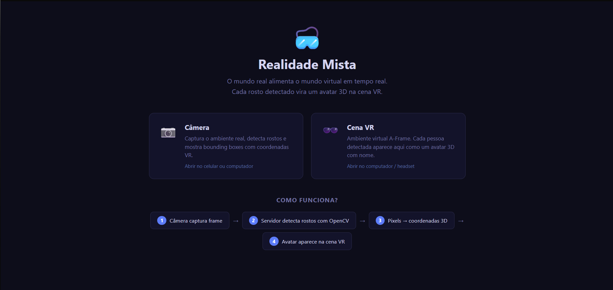
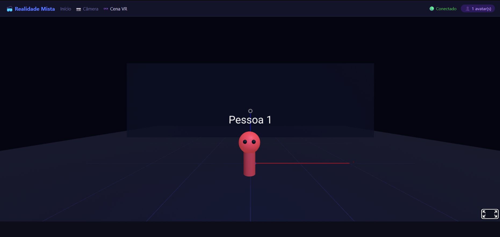

# 🥽 Realidade Mista — AR/VR + Visão Computacional

Projeto desenvolvido para a disciplina de AR/VR e Visão Computacional.
O sistema transforma rostos detectados pela câmera em avatares 3D dentro de uma cena de Realidade Virtual em tempo real.

---

## 📸 Screenshots

### Página Inicial


---

### Cena VR — Mundo Virtual (avatares 3D)


---

## 🎯 Objetivo

Criar uma experiência de **Realidade Mista** onde:

- A câmera captura o ambiente real
- Rostos são detectados e identificados em tempo real
- Cada pessoa detectada é representada por um **avatar 3D** dentro de uma cena VR
- O avatar se move conforme a pessoa se move na câmera
- O professor (ou qualquer pessoa) pode abrir a cena VR e ver todos os avatares ao vivo

---

## 🧠 Como funciona

```
Câmera (/camera)              Servidor (app.py)               Cena VR (/vr)
──────────────────            ─────────────────               ─────────────
Captura frame da webcam  →   OpenCV detecta rostos       →   A-Frame recebe
Envia via Socket.IO          Calcula coordenadas VR           evento vr_avatars
                             Rastreia ID estável              Cria/move avatares
                             Emite "vr_avatars"               em tempo real
```

### Mapeamento 2D → 3D

O núcleo do sistema é transformar pixels da câmera em posições no espaço 3D:

| Dimensão | Origem (câmera) | Destino (VR) | Lógica |
|---|---|---|---|
| **X** | posição horizontal do centroide | -5 (esq) a +5 (dir) | `(cx / largura - 0.5) * 10` |
| **Y** | — | fixo em 1.6 m | altura média dos olhos |
| **Z** | tamanho do rosto (largura em px) | profundidade simulada | rosto maior = mais perto |
| **Scale** | tamanho do rosto | tamanho do avatar | rosto maior = avatar maior |

### Rastreamento estável

Sem rastreamento, o OpenCV pode detectar os rostos em ordem diferente a cada frame — fazendo "Pessoa 1" e "Pessoa 2" trocarem e os avatares piscarem.

A solução implementada usa **distância de centroide** entre frames:
- Cada rosto detectado é comparado com os rostos rastreados no frame anterior
- O mais próximo (dentro de 120px) é considerado a mesma pessoa
- Se ninguém próximo for encontrado → nova pessoa, novo slot de cor
- Rosto ausente por mais de 8 frames → removido da memória

---

## 🛠️ Tecnologias utilizadas

| Camada | Tecnologia |
|---|---|
| Servidor web | Flask + Flask-SocketIO |
| Visão Computacional | OpenCV (Haar Cascade frontal) |
| Comunicação em tempo real | Socket.IO (WebSocket) |
| Ambiente VR | A-Frame 1.5 |
| Linguagem back-end | Python 3.10+ |
| Linguagem front-end | JavaScript puro (Vanilla JS) |

---

## 📁 Estrutura do projeto

```
projet-arvrcv/
├── app.py                  ← servidor Flask + SocketIO + OpenCV
├── requirements.txt        ← dependências Python
├── templates/
│   ├── index.html          ← página inicial com links e explicação do fluxo
│   ├── camera.html         ← painel da câmera (mundo real)
│   └── vr.html             ← cena A-Frame (mundo virtual)
└── static/
    ├── css/
    │   └── style.css       ← estilos das três páginas
    └── js/
        ├── camera.js       ← captura de frames, exibição do resultado
        └── vr.js           ← criação e atualização de avatares 3D
```

---

## ▶️ Como rodar

### 1. Pré-requisitos

- Python 3.10 ou superior
- pip

### 2. Instalar dependências

```bash
cd projet-arvrcv
pip install -r requirements.txt
```

### 3. Iniciar o servidor

```bash
python app.py
```

O servidor sobe em `http://0.0.0.0:5000`.

### 4. Acessar as páginas

| Página | URL | Quem usa |
|---|---|---|
| Início | `http://localhost:5000/` | qualquer um |
| Câmera | `http://localhost:5000/camera` | quem está sendo detectado (pode ser o celular) |
| Cena VR | `http://localhost:5000/vr` | quem quer ver os avatares |

> **Dica para usar no celular:** descubra o IP da sua máquina na rede local (ex: `192.168.1.10`) e acesse `http://192.168.1.10:5000/camera` pelo celular. O servidor e o celular precisam estar na mesma rede Wi-Fi.

---

## 🔬 Investigação realizada

### 📏 Distância

| Cenário | Resultado |
|---|---|
| Pessoa perto (< 1 m) | |
| Pessoa longe (> 2 m) | |
| Pessoa muito longe (> 4 m) | |

<!-- Descreva aqui o que observou nos testes de distância -->

---

### 😷 Acessórios

| Acessório | Detectado? | Observação |
|---|---|---|
| Óculos comuns | | |
| Óculos escuros | | |
| Máscara facial | | |
| Boné com aba | | |
| Capuz | | |

<!-- Descreva aqui o que observou nos testes de acessórios -->

---

### 🔄 Movimento e delay

<!-- Descreva aqui: o avatar acompanha bem? Existe atraso visível? Estimativa de delay em ms? -->

---

### 👥 Múltiplas pessoas

| Quantidade | Funciona? | Observação |
|---|---|---|
| 1 pessoa | | |
| 2 pessoas | | |
| 3 pessoas | | |
| 4+ pessoas | | |

<!-- Descreva aqui o comportamento com múltiplas pessoas -->

---

## 🚀 Desafios implementados

### 🟡 Desafio Master — concluído

- ✅ Nome flutuando acima da cabeça de cada avatar
- ✅ Avatar sempre "olhando" para o usuário na cena VR (`look-at`)
- ✅ Cor única por pessoa (paleta de 6 cores, atribuída por slot de rastreamento)

### 🔴 Desafio Expert

- ⬜ Máscara 3D sobre o rosto real
- ⬜ Replicação de orientação da cabeça

---

## 📖 Conceitos aplicados

**Detecção vs Reconhecimento**
- **Detecção:** o sistema identifica _onde_ há um rosto no frame (Haar Cascade)
- **Reconhecimento:** associar aquele rosto a uma pessoa específica

**Pixel vs Coordenada vs Objeto 3D**
- **Pixel:** posição em uma imagem 2D (`cx = 320, cy = 240`)
- **Coordenada:** posição no espaço 3D (`x=-1.2, y=1.6, z=2.0`)
- **Objeto 3D:** entidade A-Frame renderizada nessa coordenada

**Dificuldade do eixo Z (profundidade)**
Câmeras 2D não medem distância diretamente. A solução adotada usa o **tamanho do rosto** como aproximação: um rosto maior ocupa mais pixels → está mais próximo. É uma estimativa, não uma medição real.

**Realidade Mista**
A atividade não é puramente AR (câmera + sobreposição) nem puramente VR (mundo totalmente virtual). É **Realidade Mista**: dados do mundo real (posição dos rostos) alimentam e modificam o mundo virtual em tempo real.
